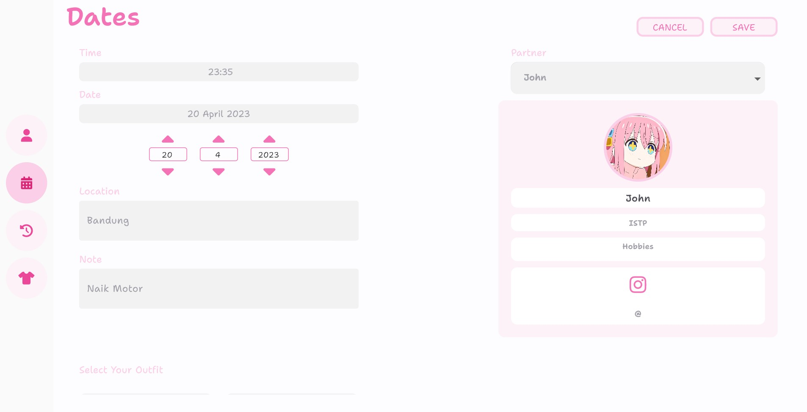

# IF2250-2023-K02-12-Dately

## Tentang Dately

Dately adalah aplikasi desktop pengatur kencan yang digunakan dalam merencanakan kencan yang akan dilakukan. Dengan adanya aplikasi ini, pengguna diharapkan dapat lebih mudah merencanakan suatu kencan dengan matang dan menjadikan suatu kencan tersebut semakin berkesan.

## Cara Menjalankan Aplikasi

1. Clone this repository
2. Change directory to the **src** folder of the repository and create python virtual environment using the following commands:

   ```bash
   # windows
   python -m virtualenv .

   # macos
   python3 -m venv .
   ```

3. Then activate it:

   ```bash
   # windows
   ./Scripts/activate

   # macos
   source ./bin/activate
   ```

4. Finally, install all the packages using:

   ```bash
   pip install -r requirements.txt
   ```

5. Run the main program using the following commands or other tools:

   ```bash
   python main.py

   # or

   python3 main.py
   ```

## Daftar Modul

### Controller

1. Nama Modul : date_controller  
   Penerima Tugas: Johanes Lee (13521148)

2. Nama Modul : history_controller
   Penerima Tugas: Irsyad Nurwidianto Basuki (13521072)

3. Nama Modul : outfit_controller
   Penerima Tugas: Farhan Nabil Suryono (13521114)

4. Nama Modul : profile_controller
   Penerima Tugas: Muhammad Zaydan Athallah (13521104)
   I Putu Bakta Hari Sudewa (13521150)

### Models

1. Nama Modul : date_model
   Penerima Tugas: Irsyad Nurwidianto Basuki (13521072)
   Johanes Lee (13521148)

2. Nama Modul : outfit_model, outfit_category_model, outfit_category_join_model, outfit_date_join_model
   Penerima Tugas: Farhan Nabil Suryono (13521114)

3. Nama Modul : profile_model
   Penerima Tugas: I Putu Bakta Hari Sudewa (13521150)

### Tests

1. Nama Modul : date_test
   Penerima Tugas: Johanes Lee (13521148)

2. Nama Modul : history_test
   Penerima Tugas: Irsyad Nurwidianto Basuki (13521072)

3. Nama Modul : outfit_test
   Penerima Tugas: Farhan Nabil Suryono (13521114)

4. Nama Modul : profile_test
   Penerima Tugas: I Putu Bakta Hari Sudewa (13521150)

### Utils

1. Nama Modul : components
   Penerima Tugas: Irsyad Nurwidianto Basuki (13521072)
   Muhammad Zaydan Athallah (13521104)
   Farhan Nabil Suryono (13521114)
   Johanes Lee (13521148)
   I Putu Bakta Hari Sudewa (13521150)

2. Nama Modul : db
   Penerima Tugas: I Putu Bakta Hari Sudewa (13521150)

### Views

1. Nama Modul : date_view
   Penerima Tugas: Johanes Lee (13521148)

   
   

2. Nama Modul : history_view
   Penerima Tugas: Irsyad Nurwidianto Basuki (13521072)

3. Nama Modul : outfit_view
   Penerima Tugas: Farhan Nabil Suryono (13521114)

4. Nama Modul : profile_view, profile_write_view
   Penerima Tugas: I Putu Bakta Hari Sudewa (13521150)

5. Nama Modul : partners_view
   Penerima Tugas: Muhammad Zaydan Athallah (13521104)

## Daftar Tabel Basis Data

- Tabel Profile (index, id, name, picture, hobbies, mbti, social_media, role, created_at, updated_at)
- Tabel Date (index, id, description, date, location, status, rating, review, partner_id, created_at, updated_at)
- Tabel Outfit (index, id, name, description, picture, created_at, updated_at)
- Tabel Outfit_Category (outfit_id, category_id)
- Tabel Outfit_Date (outfit_id, date_id)
